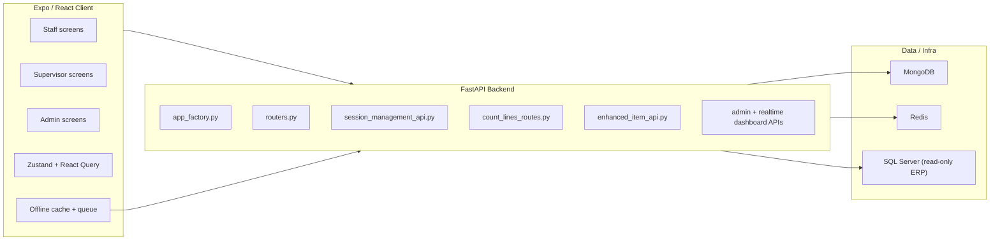
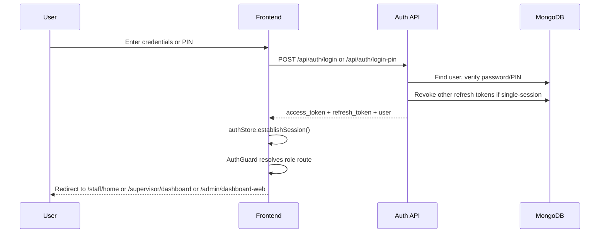
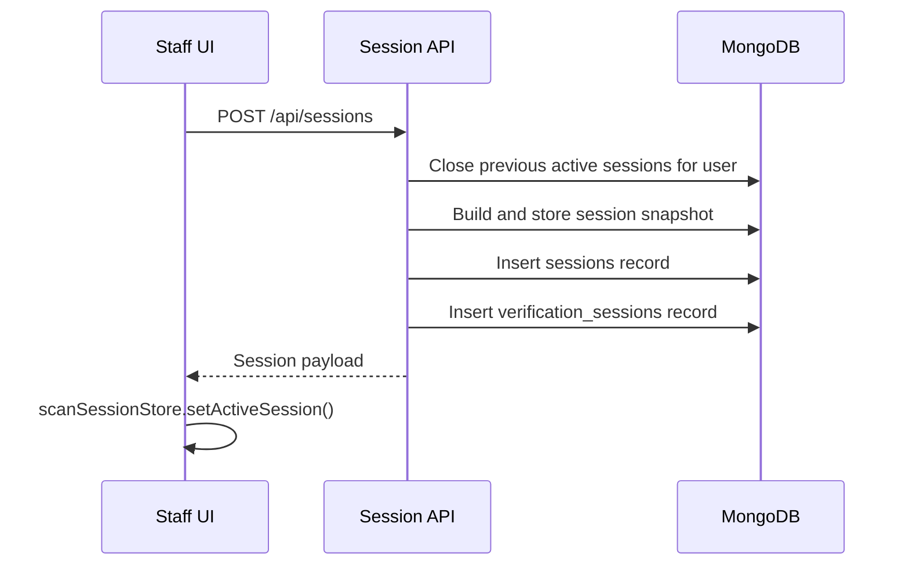
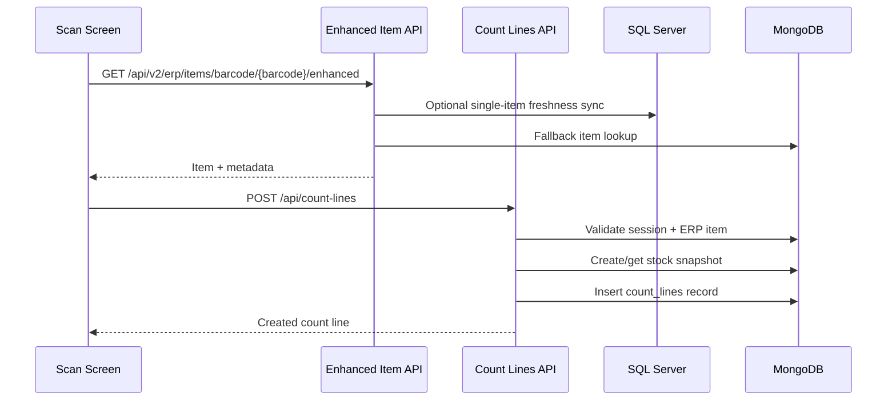
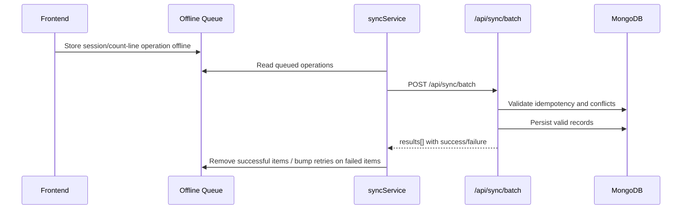

# Stock Verify Codebase Report

Date: 2026-03-20

## Purpose

Stock Verify is a stock-counting and verification system with three operating roles:

- Staff count inventory on the floor by creating sessions, scanning items, entering quantities, and submitting count lines.
- Supervisors monitor live work, review variances, assign recounts, and control session state.
- Admins monitor system health, live operations, users, reports, logs, and SQL connectivity.

The governing repository rule is:

`SQL Server -> MongoDB -> Frontend`

MongoDB is the application system of record. SQL Server is treated as read-only ERP.

## Stack Summary

| Layer | Main technology | Notes |
| --- | --- | --- |
| Frontend | Expo SDK 54, React 19, Expo Router | Runs on web and mobile |
| State | Zustand, React Query | Auth, settings, scan session, notifications |
| Local/offline | AsyncStorage, MMKV, SQLite helpers | Offline queue, caches, local sync helpers |
| Backend | FastAPI | Large router-based API composition |
| Primary store | MongoDB (Motor) | Sessions, count lines, users, notifications, reports |
| Support infra | Redis | Locks, cache, heartbeat/presence |
| ERP source | SQL Server | Read-only source for fresh stock data |
| Observability | Logging, metrics, optional Sentry/tracing | Wired during backend bootstrap |

## Codebase Size Snapshot

- `backend/api`: 70 Python files
- `backend/services`: 68 Python files
- `frontend/app`: 70 route files
- `frontend/src/components`: 246 component files
- `frontend` tests and E2E assets: 446 files
- `backend/tests`: 131 files

This is a large, actively evolved codebase with a mix of current APIs and compatibility wrappers.

## Architecture Overview



## Main Repo Areas

| Path | Role in the app |
| --- | --- |
| `backend/app_factory.py` | Backend composition root |
| `backend/core/lifespan.py` | Startup wiring for DB, cache, auth, services, background helpers |
| `backend/app/routers.py` | Central router registration |
| `backend/api/session_management_api.py` | Session lifecycle, heartbeat, stats, workflow aggregation |
| `backend/api/count_lines_routes.py` | Count-line draft, submit, approval, recount, scan status |
| `backend/api/erp_api.py` | Baseline ERP item lookup and barcode normalization |
| `backend/api/enhanced_item_api.py` | Rich item lookup with SQL-sync attempt and fallback |
| `backend/api/admin_dashboard_api.py` | Admin KPIs and system monitoring |
| `backend/api/realtime_dashboard_api.py` | Live operational dashboard, item drill-down, export |
| `frontend/app/_layout.tsx` | Frontend bootstrap and provider stack |
| `frontend/app/staff/home.tsx` | Staff session creation and active/history entry point |
| `frontend/app/staff/scan.screen.tsx` | Main counting UI |
| `frontend/app/supervisor/dashboard.tsx` | Supervisor dashboard |
| `frontend/app/supervisor/user-workflows.tsx` | Per-user live workflow board |
| `frontend/app/admin/dashboard-web.screen.tsx` | Admin overview dashboard |
| `frontend/app/admin/realtime-dashboard.screen.tsx` | Live item-level admin dashboard |
| `frontend/src/store/authStore.ts` | Login, PIN, biometrics, stored session state |
| `frontend/src/store/settingsStore.ts` | Scanner, sync, offline, theme, security preferences |
| `frontend/src/services/api/inventoryWorkflowApi.ts` | Main frontend inventory API integration |
| `frontend/src/services/syncService.ts` | Offline queue flush logic |

## Core Features

### Staff features

- Login with password, PIN, and optional biometrics
- Create or resume counting sessions by floor/rack/warehouse
- Camera scan or manual search for item lookup
- Item detail handling with quantity, damage, MRP, serials, notes, photo proof
- Misplaced-item detection and location capture
- Offline cache and deferred queueing
- Session heartbeat and live pause/close notifications over WebSocket

### Supervisor features

- Dashboard of open and historical sessions
- Create sessions for operational zones
- User workflow board showing stage, presence, progress, pending review, recount queue
- Approve or reject count lines
- Assign recounts and control paused/reconcile states
- Export and variance-related operational views

### Admin features

- KPI dashboard
- Real-time table of counted items with filters, pagination, drill-down, and export
- User management
- Logs, metrics, services status, diagnosis, SQL connectivity
- Reports, unknown-item management, security and control screens

## How The App Works

### 1. Frontend bootstrap and auth

The app starts in Expo Router and performs bootstrap before allowing navigation. It initializes storage, loads auth and settings, registers background sync, and applies theme/runtime setup.

```tsx
// frontend/app/_layout.tsx
const { cleanup } = await initializeApp({
  fontsLoaded,
  isDev: __DEV__,
  loadStoredAuth,
  loadSettings,
});

useAuthStore.getState().setLoading(false);
useAuthStore.setState({ isInitialized: true });
setIsInitialized(true);
```

`frontend/src/store/authStore.ts` is the main session store. It handles:

- credential login
- PIN login
- biometric unlock
- token persistence
- unauthorized handling
- session restoration

The backend login path is in `backend/api/auth_routes.py`. It enforces rate limiting, account checks, and strict single-session behavior before issuing access and refresh tokens.

```py
# backend/api/auth_routes.py
if getattr(settings, "AUTH_SINGLE_SESSION", True):
    session_resolution = await _ensure_single_session_for_login(
        credentials.username,
        request,
        client_ip,
    )
    if session_resolution.is_err:
        raise HTTPException(
            status_code=409,
            detail={
                "error": "AUTH_SESSION_CONFLICT",
                "message": "Unable to recover the existing active session",
            },
        )
```

### 2. Backend application composition

The backend uses a single FastAPI app with a very large router registry. `backend/app_factory.py` imports the router modules and `backend/app/routers.py` composes them.

```py
# backend/app/routers.py
app.include_router(registry.auth_router, prefix="/api")
app.include_router(registry.search_router)
app.include_router(registry.sync_router, prefix="/api")
app.include_router(registry.session_mgmt_router)
app.include_router(registry.reporting_router)
app.include_router(registry.websocket_router)
app.include_router(registry.enhanced_item_router)
app.include_router(registry.notifications_router)
```

`backend/core/lifespan.py` initializes:

- Mongo client and DB handle
- Redis/cache services
- monitoring and tracing
- SQL connector
- auth dependencies
- default data and background services

This file is the real runtime wiring center of the backend.

### 3. Session creation and lifecycle

The session lifecycle is defined in `backend/services/session_state_machine.py`:

- `OPEN`
- `ACTIVE`
- `PAUSED`
- `RECONCILE`
- `COMPLETED`
- `CLOSED`
- `CANCELLED`

Session creation happens in `backend/api/session_management_api.py`. The logic is important because it combines governance and compatibility behavior:

- validates warehouse/location input
- checks for an existing open session in the same warehouse
- closes other active sessions for the same user
- revokes prior refresh tokens
- creates a hashed snapshot of session items
- writes to both `sessions` and `verification_sessions`

```py
# backend/api/session_management_api.py
await db.sessions.update_many(
    open_sessions_filter,
    {
        "$set": {
            "status": "CLOSED",
            "completed_at": now_dt,
            "close_reason": "SYSTEM_AUTO_CLOSE_NEW_SESSION",
        }
    },
)

snapshot_items = await _collect_snapshot_items(
    db,
    warehouse,
    location_type=location_type,
    location_name=location_name,
    rack_no=rack_no,
)

await db.session_snapshots.insert_one(snapshot.model_dump())
await db.sessions.insert_one(session_doc)
await db.verification_sessions.insert_one(verification_session)
```

This dual-write pattern is one of the key architecture traits of the repo. Newer workflow logic often uses `verification_sessions`, while broader business/session logic still reads `sessions`.

### 4. Item lookup and barcode normalization

The backend barcode rules are centralized in `backend/api/erp_api.py` under `_normalize_barcode_input`. This is explicitly called out in repo instructions and is a critical normalization point.

```py
# backend/api/erp_api.py
if strict_numeric and normalized.isdigit():
    if len(normalized) != 6:
        raise HTTPException(status_code=400, detail={...})

    if normalized[:2] not in {"51", "52", "53"}:
        raise HTTPException(status_code=400, detail={...})

    return normalized
```

The frontend uses `frontend/src/services/api/inventoryWorkflowApi.ts` as the main item-retrieval client. It:

- validates barcode input
- checks offline cache first when offline
- calls the enhanced item endpoint when online
- falls back to cache on API failure
- records data-source metadata (`api`, `sql`, `cache`, `offline`)

```ts
// frontend/src/services/api/inventoryWorkflowApi.ts
const response = await api.get(
  `/api/v2/erp/items/barcode/${encodeURIComponent(trimmedBarcode)}/enhanced`,
  {
    params: { session_id: sessionId, rack_no: rackNo },
  }
);

const itemData = response.data.item || response.data;
```

The enhanced backend endpoint in `backend/api/enhanced_item_api.py` attempts a targeted SQL-sync for freshness, then falls back to Mongo/cache if needed.

### 5. Count-line creation and variance workflow

The central operational write path is `POST /count-lines` in `backend/api/count_lines_routes.py`. This is where the counting workflow becomes persisted business data.

The handler does several things:

- validates the session exists and is active
- resolves the ERP item by barcode or item code
- freezes or retrieves a stock snapshot for baseline comparison
- calculates variance
- requires a correction reason when variance exists
- detects risk flags and misplaced stock
- applies locking to avoid races

```py
# backend/api/count_lines_routes.py
if session.get("status") not in ["OPEN", "ACTIVE"]:
    raise HTTPException(status_code=400, detail="Session is not active")

erp_snapshot = await _snapshot_service.get_or_create_snapshot(
    line_data.session_id, line_data.item_code, current_user["username"]
)

erp_qty = float(erp_qty_raw or 0)
variance = line_data.counted_qty - erp_qty

if abs(variance) > 0 and not line_data.correction_reason and not line_data.variance_reason:
    raise HTTPException(
        status_code=400,
        detail="Correction reason is mandatory when variance exists",
    )
```

Approval and rejection are also first-class workflow steps:

- supervisors/admins can approve a line
- rejection reopens the line as a recount path
- assigned recount ownership is tracked on the count line

The state model for this is formalized in `backend/services/count_state_machine.py`.

### 6. Supervisor monitoring and workflow aggregation

The supervisor-facing workflow board is a genuine aggregated operational view, not just a UI filter. The backend endpoint `GET /api/sessions/user-workflows` builds per-user summaries by combining:

- active verification sessions
- session metadata
- count-line counts
- pending approvals
- recount assignments
- user identity details

```py
# backend/api/session_management_api.py
active_sessions_cursor = db.verification_sessions.find(
    {"status": {"$in": sorted(ACTIVE_WORKFLOW_SESSION_STATES)}}
).sort("last_heartbeat", -1)

session_count_rows = await db.count_lines.aggregate([...]).to_list(...)
pending_rows = await db.count_lines.aggregate([...]).to_list(...)
```

The frontend screen `frontend/app/supervisor/user-workflows.tsx` turns that into:

- workflow stage
- presence badge
- next action
- queue sizes
- SLA-like timing cues
- progress bars

This is one of the clearest examples of business workflow being encoded explicitly across backend aggregation plus frontend presentation.

### 7. Real-time behavior

The app uses WebSocket updates for session-related live events. The backend endpoint is `backend/api/websocket_api.py`, backed by `backend/core/websocket_manager.py`.

The staff scan screen subscribes through `frontend/src/hooks/useWebSocket.ts` and reacts to session state changes such as pause and close.

```ts
// frontend/src/hooks/useWebSocket.ts
const wsUrl = API_BASE_URL.replace(/^http/, "ws") + "/ws/updates";
if (sessionId) {
  query.set("session_id", sessionId);
}
const socket = new WebSocket(urlWithParams);
```

This matters operationally because supervisors can push session status changes and staff clients can react without polling.

### 8. Offline-first support and sync

Offline support is a major design pillar of the frontend. The codebase keeps:

- cached items
- cached sessions
- cached count lines
- an offline operation queue

in `frontend/src/services/offline/offlineStorage.ts`.

Background and reconnect-based replay happen through `frontend/src/services/syncService.ts` and `frontend/src/services/offline/syncService.ts`.

```ts
// frontend/src/services/syncService.ts
if (!isOnline()) {
  return { success: 0, failed: 0, total: 0, errors: [] };
}

const queue = await getOfflineQueue();
const response = await syncBatch(operations);
await removeManyFromOfflineQueue(successIds);
```

This is one of the main reasons the frontend service layer is larger than average. It is not a thin API wrapper; it is a network-aware workflow layer.

### 9. Admin observability and operations

Admins have two major monitoring surfaces:

- `frontend/app/admin/dashboard-web.screen.tsx`
- `frontend/app/admin/realtime-dashboard.screen.tsx`

These connect to:

- `backend/api/admin_dashboard_api.py`
- `backend/api/realtime_dashboard_api.py`

The admin stack covers:

- live KPIs
- system status
- health score and diagnosis
- service control
- live counted-item table
- item drill-down
- report generation and export
- user administration

The code here shows that the app is not only a counting tool. It is also an operational control surface.

## Important Data Model Notes

Collections and persisted domains visible in the code include:

- `users`
- `sessions`
- `verification_sessions`
- `count_lines`
- `count_line_drafts`
- `erp_items`
- `session_snapshots`
- `stock_snapshots`
- `notifications`
- `audit_logs`
- `refresh_tokens`
- `user_presence`
- `locks`

Important nuance:

- `sessions` and `verification_sessions` both participate in workflow behavior
- count-line approvals/recounts are persisted on `count_lines`
- snapshot collections are used to freeze baselines for reconciliation integrity

## Design and Implementation Characteristics

### Strengths

- Clear role segmentation across staff, supervisor, and admin routes
- Strong operational workflow modeling around sessions and count lines
- Good offline-first coverage in the frontend
- Real-time update path exists for live operations
- Explicit state-machine and snapshot concepts reduce hidden workflow logic

### Complexity points

- Compatibility wrappers and newer APIs coexist, so there are duplicate-looking surfaces
- Session data is split across `sessions` and `verification_sessions`
- Some large files hold critical logic and are hard to reason about quickly
- Governance-restricted files mean some core ERP verification logic is intentionally fenced off

## Best Starting Read Order

1. `README.md`
2. `docs/user-wise-running-workflow-diagram.md`
3. `backend/app_factory.py`
4. `backend/core/lifespan.py`
5. `backend/app/routers.py`
6. `backend/api/auth_routes.py`
7. `backend/api/session_management_api.py`
8. `backend/api/count_lines_routes.py`
9. `backend/api/erp_api.py`
10. `backend/api/enhanced_item_api.py`
11. `frontend/app/_layout.tsx`
12. `frontend/src/store/authStore.ts`
13. `frontend/app/staff/home.tsx`
14. `frontend/app/staff/scan.screen.tsx`
15. `frontend/src/services/api/inventoryWorkflowApi.ts`
16. `frontend/src/services/syncService.ts`
17. `frontend/app/supervisor/dashboard.tsx`
18. `frontend/app/supervisor/user-workflows.tsx`
19. `frontend/app/admin/dashboard-web.screen.tsx`
20. `frontend/app/admin/realtime-dashboard.screen.tsx`

## Build, Run, and Test Commands

- Start full app: `make start`
- Backend only: `make backend`
- Frontend only: `make frontend`
- Compact CI: `make agent-ci`
- Backend tests: `make python-test`
- Frontend tests: `make node-test`
- Full CI: `make ci`
- Frontend E2E: `cd frontend && npm run e2e:recount-smoke`

## Final Assessment

This repository is a production-style operational application, not a small CRUD app. Its center of gravity is the inventory verification workflow:

- authenticate user
- open a counting session
- scan and enrich item context
- freeze stock baseline
- submit count line
- review variance
- approve or recount
- monitor progress and system health

The most important files are the ones that implement those steps directly:

- `backend/api/session_management_api.py`
- `backend/api/count_lines_routes.py`
- `backend/api/erp_api.py`
- `backend/api/enhanced_item_api.py`
- `frontend/app/staff/scan.screen.tsx`
- `frontend/src/services/api/inventoryWorkflowApi.ts`
- `frontend/src/services/syncService.ts`

If a new engineer understands those files, plus the backend/frontend composition roots, they will understand most of the app's actual behavior.

## Appendix A: Frontend Route Inventory

The frontend route tree is role-segmented under Expo Router.

### Public routes

- `/welcome`
- `/login`
- `/register`
- `/forgot-password`
- `/otp-verification`
- `/reset-password`
- `/help`
- `/security`
- `/notifications`
- `/debug`

### Staff routes

- `/staff/home`
- `/staff/history`
- `/staff/scan`
- `/staff/item-detail`
- `/staff/serial-scanner`
- `/staff/settings`
- `/staff/appearance`

### Supervisor routes

- `/supervisor/dashboard`
- `/supervisor/sessions`
- `/supervisor/user-workflows`
- `/supervisor/variances`
- `/supervisor/variance-details`
- `/supervisor/items`
- `/supervisor/bulk-ops`
- `/supervisor/export`
- `/supervisor/export-results`
- `/supervisor/export-schedules`
- `/supervisor/offline-queue`
- `/supervisor/error-logs`
- `/supervisor/activity-logs`
- `/supervisor/notes`
- `/supervisor/sync-conflicts`
- `/supervisor/watchtower`
- `/supervisor/db-mapping`
- `/supervisor/settings`
- `/supervisor/appearance`
- `/supervisor/session/[id]`

### Admin routes

- `/admin/dashboard-web`
- `/admin/realtime-dashboard`
- `/admin/live-view`
- `/admin/logs`
- `/admin/metrics`
- `/admin/reports`
- `/admin/users`
- `/admin/permissions`
- `/admin/security`
- `/admin/settings`
- `/admin/sql-config`
- `/admin/unknown-items`
- `/admin/control-panel`
- `/admin/control-panel-v2`
- `/admin/ai-assistant`

### Route wrappers

Several routes use a thin wrapper pattern:

- `*.tsx` re-exports `*.screen.tsx`
- UI-heavy screen logic stays in the `.screen.tsx` file
- route path remains stable while screen implementation can evolve

Examples:

- `frontend/app/staff/scan.tsx` -> `frontend/app/staff/scan.screen.tsx`
- `frontend/app/admin/dashboard-web.tsx` -> `frontend/app/admin/dashboard-web.screen.tsx`
- `frontend/app/admin/realtime-dashboard.tsx` -> `frontend/app/admin/realtime-dashboard.screen.tsx`

## Appendix B: Route Protection and Default Navigation

Role-based landing and authorization are explicit, not inferred.

```ts
// frontend/src/utils/roleNavigation.ts
export const getRouteForRole = (role: UserRole): string => {
  switch (role) {
    case "supervisor":
      return "/supervisor/dashboard";
    case "admin":
      return "/admin/dashboard-web";
    case "staff":
      return "/staff/home";
    default:
      return "/welcome";
  }
};
```

The auth guard enforces:

- redirect unauthenticated users away from protected routes
- redirect authenticated users away from public auth screens
- block users from role-forbidden route groups
- start and stop notification polling with auth lifecycle

```tsx
// frontend/src/components/auth/AuthGuard.tsx
if (!user && requiresAuth) {
  router.replace("/welcome");
  return;
}

if (user && inAuthGroup) {
  const targetRoute = getRouteForRole(user.role as UserRole);
  router.replace(targetRoute as any);
  return;
}

if (user && inProtectedGroup) {
  const currentPath = "/" + segments.join("/");
  if (!isRouteAllowedForRole(currentPath, user.role as UserRole)) {
    const targetRoute = getRouteForRole(user.role as UserRole);
    router.replace(targetRoute as any);
    return;
  }
}
```

## Appendix C: Detailed Backend API Surface

This is the practical API map for the most important workflow surfaces.

### Auth and account

From `backend/api/auth_routes.py`:

| Endpoint | Purpose |
| --- | --- |
| `POST /api/auth/register` | Create user account |
| `POST /api/auth/login` | Username/password login |
| `POST /api/auth/login-pin` | PIN login |
| `POST /api/auth/pin-setup` | Initial PIN setup |
| `GET /api/auth/me` | Current user identity |
| `GET /api/auth/heartbeat` | Session/auth keepalive |
| `POST /api/auth/change-pin` | Change PIN |
| `POST /api/auth/change-password` | Change password |
| `POST /api/auth/password-reset/request` | Start password reset |
| `POST /api/auth/password-reset/verify` | Verify reset step |
| `POST /api/auth/password-reset/confirm` | Finalize reset |

### Session lifecycle

From `backend/api/session_management_api.py`:

| Endpoint | Purpose |
| --- | --- |
| `GET /api/sessions` | Paginated sessions list |
| `POST /api/sessions` | Create session |
| `GET /api/sessions/active` | Active verification sessions |
| `GET /api/sessions/user-workflows` | Aggregated supervisor workflow board |
| `GET /api/sessions/analytics` | Session analytics |
| `GET /api/sessions/{session_id}` | Session detail |
| `GET /api/sessions/{session_id}/stats` | Session stats |
| `POST /api/sessions/{session_id}/heartbeat` | Renew activity and rack lock |
| `PUT /api/sessions/{session_id}/status` | Transition status |
| `POST /api/sessions/{session_id}/complete` | Close session |
| `GET /api/sessions/user/history` | User session history |
| `GET /api/sessions/{session_id}/integrity` | Session integrity check |
| `POST /api/sessions/logout-all` | Revoke all active login state |

### Count lines and review

From `backend/api/count_lines_routes.py`:

| Endpoint | Purpose |
| --- | --- |
| `POST /api/count-lines/draft` | Autosave draft |
| `POST /api/count-lines` | Submit count line |
| `PUT /api/count-lines/{line_id}/verify` | Mark verified |
| `PUT /api/count-lines/{line_id}/unverify` | Remove verify mark |
| `GET /api/count-lines` | Query count lines |
| `GET /api/count-lines/{line_id}` | Read single line |
| `PUT /api/count-lines/{line_id}/approve` | Supervisor approval |
| `PUT /api/count-lines/{line_id}/reject` | Reject and recount |
| `GET /api/count-lines/check/{session_id}/{item_code}` | Check existing item scans |
| `GET /api/count-lines/check-serial/{session_id}/{serial_number}` | Serial uniqueness check |
| `GET /api/count-lines/session/{session_id}` | Count lines by session |
| `PATCH /api/count-lines/{line_id}/add-quantity` | Increment quantity |
| `PUT /api/count-lines/{line_id}` | Update line |
| `DELETE /api/count-lines/{line_id}` | Delete line |
| `GET /api/sessions/{session_id}/items/{item_code}/scan-status` | Scan history by item/session |
| `POST /api/count-lines/bulk/approve` | Bulk approvals |
| `POST /api/count-lines/bulk/reject` | Bulk rejection |
| `POST /api/count-lines/resolve-conflict` | Conflict resolution |
| `GET /api/count-lines/item-batches/{item_identifier}` | Batch detail lookup |

### ERP and item lookup

From `backend/api/erp_api.py` and `backend/api/enhanced_item_api.py`:

| Endpoint | Purpose |
| --- | --- |
| `GET /api/erp/items/barcode/{barcode}` | Basic barcode item lookup |
| `POST /api/erp/items/{item_code}/refresh-stock` | Refresh/fetch stock from Mongo-backed ERP view |
| `GET /api/erp/config` | ERP config and connection health |
| `GET /api/item-batches/{item_code}` | Batch data |
| `POST /api/erp/test` | ERP test operation |
| `GET /api/erp/items` | Item listing |
| `GET /api/items/search` | Search endpoint |
| `GET /api/v2/erp/items/barcode/{barcode}/enhanced` | SQL-aware enhanced barcode lookup |
| `GET /api/v2/erp/items/search/advanced` | Advanced search |
| `GET /api/v2/erp/items/locations` | Locations metadata |
| `GET /api/v2/erp/items/performance/stats` | Lookup performance metrics |
| `POST /api/v2/erp/items/sync/realtime` | Trigger realtime sync |
| `GET /api/v2/erp/items/database/status` | DB status |
| `POST /api/v2/erp/items/database/optimize` | DB optimize action |

### Sync

From `backend/api/sync_batch_api.py`:

| Endpoint | Purpose |
| --- | --- |
| `POST /api/sync/batch` | Replay offline records in batches |
| `POST /api/sync/heartbeat` | Lightweight sync-side heartbeat |

### Admin monitoring

From `backend/api/admin_dashboard_api.py`:

| Endpoint | Purpose |
| --- | --- |
| `GET /api/admin/dashboard/kpis` | Live KPIs |
| `GET /api/admin/dashboard/system-status` | System health/status |
| `GET /api/admin/dashboard/active-users` | Active user list |
| `GET /api/admin/dashboard/error-logs` | Error log feed |
| `GET /api/admin/dashboard/performance-metrics` | Performance metrics |
| `GET /api/admin/dashboard/summary` | Combined summary |

### Real-time dashboard

From `backend/api/realtime_dashboard_api.py`:

| Endpoint | Purpose |
| --- | --- |
| `GET /api/dashboard/columns` | Column definitions |
| `POST /api/dashboard/data` | Main dashboard dataset |
| `GET /api/dashboard/item/{item_id}` | Item drill-down |
| `GET /api/dashboard/stats` | Realtime dashboard stats |
| `GET /api/dashboard/filters/options` | Filter metadata |
| `GET /api/dashboard/stream` | SSE stream |
| `POST /api/dashboard/export/csv` | CSV export |
| `POST /api/dashboard/export/xlsx` | XLSX export |

### User management

From `backend/api/user_management_api.py`:

| Endpoint | Purpose |
| --- | --- |
| `GET /api/users` | User list |
| `GET /api/users/assignable/staff` | Assignable staff list |
| `GET /api/users/{user_id}` | User detail |
| `POST /api/users` | Create user |
| `PUT /api/users/{user_id}` | Update user |
| `DELETE /api/users/{user_id}` | Delete user |
| `POST /api/users/bulk` | Bulk user action |
| `GET /api/users/roles/available` | Role list |
| `POST /api/users/{user_id}/reset-password` | Password reset by admin |
| `POST /api/users/{user_id}/reset-pin` | PIN reset by admin |

### Reports and exports

From `backend/api/report_generation_api.py` and `backend/api/exports_api.py`:

| Endpoint | Purpose |
| --- | --- |
| `GET /api/reports/types` | Supported report types |
| `POST /api/reports/generate` | Generate report payload |
| `POST /api/reports/export/csv` | CSV export |
| `POST /api/reports/export/xlsx` | XLSX export |
| `GET /api/reports/filters/{report_type}` | Filter metadata |
| `POST /api/exports/schedules` | Create scheduled export |
| `GET /api/exports/schedules` | List schedules |
| `GET /api/exports/schedules/{schedule_id}` | Schedule detail |
| `PUT /api/exports/schedules/{schedule_id}` | Update schedule |
| `DELETE /api/exports/schedules/{schedule_id}` | Delete schedule |
| `POST /api/exports/schedules/{schedule_id}/execute` | Run schedule now |
| `GET /api/exports/results` | Export results |
| `GET /api/exports/results/{result_id}/download` | Download export artifact |

## Appendix D: Persistent Storage Inventory

### MongoDB collections

| Collection | Main usage | Seen in |
| --- | --- | --- |
| `users` | Auth, identity, role, PIN state | `auth_routes.py`, `refresh_token.py` |
| `sessions` | Canonical business sessions | `session_management_api.py`, sync flows |
| `verification_sessions` | Active/live workflow sessions | `session_management_api.py` |
| `count_lines` | Submitted counting work | `count_lines_routes.py` |
| `count_line_drafts` | Autosaved count drafts | `count_lines_routes.py` |
| `erp_items` | Item master and stock values | `erp_api.py`, `enhanced_item_api.py` |
| `session_snapshots` | Session-level frozen inventory snapshot | `session_management_api.py` |
| `stock_snapshots` | Item/session baseline snapshot | `snapshot_service.py` |
| `notifications` | User notification feed | `notification_service.py` |
| `audit_logs` | Audit trail | dashboard and audit services |
| `refresh_tokens` | Refresh-token persistence | `refresh_token.py` |
| `user_presence` | Presence analytics | `admin_dashboard_api.py` |
| `locks` | Mongo lock service keys | `lock_service.py` |
| `idempotency_operations` | Offline replay dedupe | `sync_batch_api.py` |
| `item_serials` | Synced serial-level records | `sync_batch_api.py` |

### Redis key patterns

From `backend/services/lock_manager.py`:

| Key pattern | Purpose |
| --- | --- |
| `rack:lock:{rack_id}` | Exclusive rack lock |
| `user:heartbeat:{user_id}` | User presence/heartbeat |
| `session:lock:{session_id}` | Session metadata lock |

```py
// backend/services/lock_manager.py
lock_key = f"rack:lock:{rack_id}"
heartbeat_key = f"user:heartbeat:{user_id}"
session_key = f"session:lock:{session_id}"
```

### Frontend local SQLite tables

The app also stores a minimal offline working set in SQLite.

```ts
// frontend/src/db/localDb.ts
CREATE TABLE IF NOT EXISTS items (
  barcode TEXT PRIMARY KEY,
  name TEXT,
  category TEXT,
  verified INTEGER DEFAULT 0,
  last_sync TEXT
);

CREATE TABLE IF NOT EXISTS pending_verifications (
  id INTEGER PRIMARY KEY AUTOINCREMENT,
  barcode TEXT,
  verified INTEGER,
  timestamp TEXT,
  username TEXT,
  variance INTEGER,
  status TEXT DEFAULT 'pending'
);

CREATE TABLE IF NOT EXISTS pending_count_lines (
  id INTEGER PRIMARY KEY AUTOINCREMENT,
  session_id TEXT NOT NULL,
  item_code TEXT NOT NULL,
  payload_json TEXT NOT NULL,
  created_at TEXT NOT NULL
);
```

This storage supports:

- offline item search
- pending verification persistence
- pending count-line replay
- approximate local stats for offline screens

## Appendix E: Detailed Sequence Walkthroughs

### E1. Login to role landing



### E2. Create session and start counting



### E3. Scan and submit count line



### E4. Offline replay



## Appendix F: Offline Sync Mechanics

The frontend sync layer is not a simple retry helper. It batches records, respects settings, avoids concurrent runs, and reconciles local cache after success.

```ts
// frontend/src/services/syncService.ts
if (isSyncing) {
  return { success: 0, failed: 0, total: 0, errors: [] };
}

const queue = await getOfflineQueue();
const response = await syncBatch(operations);
await removeManyFromOfflineQueue(successIds);
```

The backend replay endpoint also handles:

- rate limiting
- idempotency by client record ID
- conflict detection
- bulk session operations
- legacy operation payload compatibility

```py
# backend/api/sync_batch_api.py
existing_op = await db.idempotency_operations.find_one(
    {"operation_id": record.client_record_id}
)

if existing_op:
    ok_records.append(record.client_record_id)
    continue
```

This is important because the application expects mobile/network instability and is designed to reconcile rather than simply fail hard.

## Appendix G: Concurrency, Locks, and Token Security

### Rack and presence locking

Rack ownership and user presence are actively managed in Redis.

```py
# backend/services/lock_manager.py
acquired = await self.redis.set(lock_key, user_id, ex=ttl, nx=True)
await self.redis.set(heartbeat_key, timestamp, ex=ttl)
```

### Per-count-line write locking

The count-line creation path also uses Mongo-backed locking through `backend/services/lock_service.py` plus uniqueness checks in `count_lines_routes.py`.

This is used to prevent:

- duplicate location scans
- conflicting writes on the same item/rack
- concurrent variant-family updates inside the same session

### Refresh token model

Refresh tokens are stored as hashes, rotated on use, and revoked per user during new login.

```py
# backend/services/refresh_token.py
token_hash = _hash_token(token)
await self.revoke_all_user_tokens(username, grace_period_seconds=10)
await self.db.refresh_tokens.insert_one({
    "token_hash": token_hash,
    "username": username,
    "created_at": datetime.now(timezone.utc),
    "expires_at": expires_at,
    "revoked": False,
})
```

This gives the codebase a stronger session model than a typical simple JWT-only setup.

## Appendix H: Notifications and Presence

Notifications are polled from the frontend side and bound to auth lifecycle.

```ts
// frontend/src/store/notificationStore.ts
export const startNotificationPolling = (intervalMs = 30000) => {
  if (pollingInterval) return;
  useNotificationStore.getState().fetchUnreadCount();
  pollingInterval = setInterval(() => {
    useNotificationStore.getState().fetchUnreadCount();
  }, intervalMs);
};
```

The notification system is used for workflow feedback such as recount-related events and approval results.

## Appendix I: Key Hotspots and Risk Areas

### Restricted or governance-sensitive files

Per `backend/README.md`, these are explicitly restricted:

- `backend/services/sql_verification_service.py`
- `backend/services/sql_sync_service.py`
- `backend/api/item_verification_api.py`
- `backend/config/governance.py`
- `backend/sql_server_connector.py`

These files should be treated as high-risk because they sit on ERP verification and governance boundaries.

### Large and operationally important files

Some of the largest and most central modules are:

- `backend/api/session_management_api.py`
- `backend/api/count_lines_routes.py`
- `backend/api/legacy_routes_impl.py`
- `backend/app_factory.py`
- `backend/api/auth_routes.py`
- `backend/sql_server_connector.py`
- `frontend/src/services/api/inventoryWorkflowApi.ts`
- `frontend/src/store/authStore.ts`
- `frontend/src/components/admin/ErrorLogsPanel.tsx`
- `frontend/src/services/api/adminOperationsApi.ts`

These are the files most likely to require careful reading before any non-trivial changes.

## Appendix J: Recent Change Signals

Recent commit subjects show the current development themes:

- logout and theme initialization fixes
- reporting/API cleanup
- N+1 query fixes in supervisor and admin APIs
- offline sync endpoint addition
- requirement validation and application dossier docs
- PIN auth hardening
- frontend performance work like virtualized lists

This suggests the codebase is actively being tightened around:

- performance
- operational reliability
- documentation
- auth/session correctness
- reporting and admin visibility

## Appendix K: Suggested Read Path For Different Engineers

### For frontend engineers

1. `frontend/app/_layout.tsx`
2. `frontend/src/components/auth/AuthGuard.tsx`
3. `frontend/src/store/authStore.ts`
4. `frontend/src/store/settingsStore.ts`
5. `frontend/app/staff/home.tsx`
6. `frontend/app/staff/scan.screen.tsx`
7. `frontend/src/services/api/inventoryWorkflowApi.ts`
8. `frontend/src/services/syncService.ts`
9. `frontend/app/supervisor/user-workflows.tsx`
10. `frontend/app/admin/realtime-dashboard.screen.tsx`

### For backend engineers

1. `backend/app_factory.py`
2. `backend/core/lifespan.py`
3. `backend/app/routers.py`
4. `backend/api/auth_routes.py`
5. `backend/api/session_management_api.py`
6. `backend/api/count_lines_routes.py`
7. `backend/api/erp_api.py`
8. `backend/api/enhanced_item_api.py`
9. `backend/api/sync_batch_api.py`
10. `backend/api/realtime_dashboard_api.py`

### For full-stack or product engineers

1. `docs/user-wise-running-workflow-diagram.md`
2. `frontend/app/staff/home.tsx`
3. `frontend/app/staff/scan.screen.tsx`
4. `backend/api/session_management_api.py`
5. `backend/api/count_lines_routes.py`
6. `frontend/app/supervisor/user-workflows.tsx`
7. `backend/api/admin_dashboard_api.py`
8. `frontend/app/admin/dashboard-web.screen.tsx`
