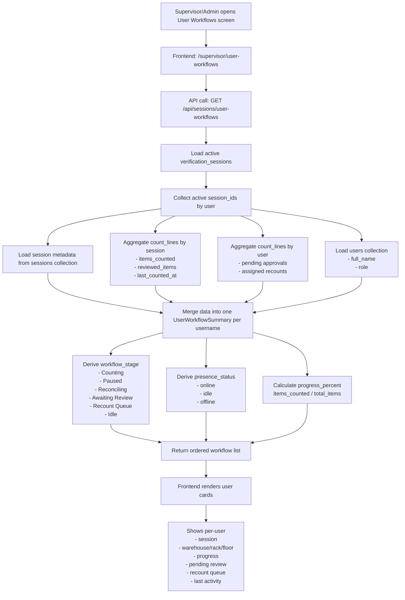
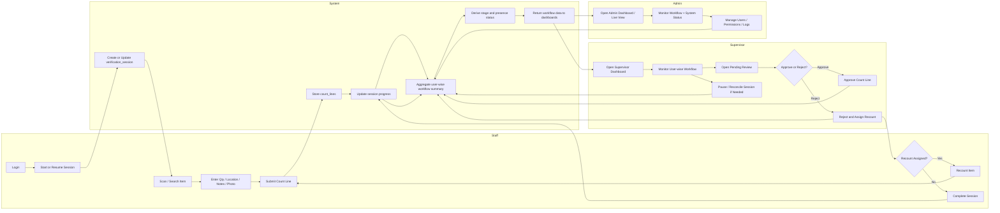

# User-Wise Running Workflow

## Notes

- Source screen: `frontend/app/supervisor/user-workflows.tsx`
- Source endpoint: `backend/api/session_management_api.py`
- The view is available to supervisors and admins.

## End-to-End Functional Flow

## Swimlane Diagram

```mermaid
flowchart LR
    classDef staff fill:#1d4ed8,stroke:#0f172a,color:#ffffff,stroke-width:1px;
    classDef supervisor fill:#f59e0b,stroke:#451a03,color:#111827,stroke-width:1px;
    classDef admin fill:#7c3aed,stroke:#2e1065,color:#ffffff,stroke-width:1px;
    classDef system fill:#0f766e,stroke:#042f2e,color:#ffffff,stroke-width:1px;
    classDef decision fill:#f8fafc,stroke:#334155,color:#0f172a,stroke-width:1px;

    subgraph StaffLane["Staff"]
        direction TB
        ST1["Login"]:::staff
        ST2["Start / Resume Session"]:::staff
        ST3["Scan or Search Item"]:::staff
        ST4["Enter Qty / Notes / Photo"]:::staff
        ST5["Submit Count Line"]:::staff
        ST6{"Recount Assigned?"}:::decision
        ST7["Recount Item"]:::staff
        ST8["Complete Session"]:::staff
    end

    subgraph SupervisorLane["Supervisor"]
        direction TB
        SP1["Open Dashboard"]:::supervisor
        SP2["Monitor User-wise Workflow"]:::supervisor
        SP3["Open Pending Review"]:::supervisor
        SP4{"Approve or Reject?"}:::decision
        SP5["Approve Count Line"]:::supervisor
        SP6["Reject + Assign Recount"]:::supervisor
        SP7["Pause / Reconcile Session"]:::supervisor
    end

    subgraph AdminLane["Admin"]
        direction TB
        AD1["Open Admin Dashboard"]:::admin
        AD2["Review Live Operations"]:::admin
        AD3["Manage Users / Permissions / Logs"]:::admin
    end

    subgraph SystemLane["System"]
        direction TB
        SY1["Create / Update verification_session"]:::system
        SY2["Store count_lines"]:::system
        SY3["Update Session Progress"]:::system
        SY4["Aggregate User Workflow Summary"]:::system
        SY5["Derive Stage + Presence"]:::system
        SY6["Return Workflow Data"]:::system
    end

    ST1 --> ST2 --> SY1
    SY1 --> ST3 --> ST4 --> ST5 --> SY2
    SY2 --> SY3 --> SY4 --> SY5 --> SY6

    SY6 --> SP1 --> SP2 --> SP3 --> SP4
    SP4 -->|Approve| SP5 --> SY4
    SP4 -->|Reject| SP6 --> SY4
    SP6 --> ST6
    ST6 -->|Yes| ST7 --> ST5
    ST6 -->|No| ST8 --> SY3

    SP2 --> SP7 --> SY4

    SY6 --> AD1 --> AD2 --> AD3 --> SY4
```

