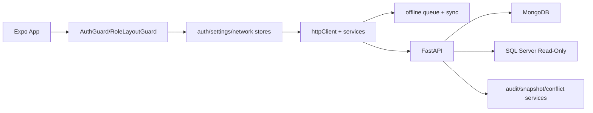

# Entire App Governance + Architecture Report

## 2.1 Executive Summary (1 page)
- System: Expo RN app + FastAPI backend for stock counting, verification, reconciliation, and governance workflows.
- As-is architecture: expo-router routes, Auth/RBAC guards, axios client with dynamic URL detection, offline queue + sync; FastAPI routers + Mongo operational data + SQL read-only observer.
- Top risks: partial UI governance surfacing, split offline queues, incomplete end-to-end idempotency, LAN-biased messaging, large UI files, partial CI strictness.
- Top quick wins: enforce idempotency contract globally, unify queue, expose snapshot/session/sql status in key screens, remove LAN-only language, tighten CI gates.
- Compliance: **PARTIAL** (server-side governance controls exist, end-to-end and UI consistency gaps remain).
(evidence: frontend/app/_layout.tsx, frontend/src/services/httpClient.ts, frontend/src/services/offline/offlineStorage.ts, backend/api/session_management_api.py, backend/services/sql_verification_service.py)

## 2.2 Repository Map
- Frontend: `frontend/app`, `frontend/src/components`, `frontend/src/store`, `frontend/src/services`
- Backend: `backend/server.py`, `backend/api`, `backend/services`, `backend/middleware`
- Quality/CI: `.github/workflows`, `frontend/package.json`, `frontend/tsconfig.json`, `backend/pyproject.toml`, `backend/pytest.ini`
- Runtime config flow: `EXPO_PUBLIC_BACKEND_URL` + `ConnectionManager` health probing + backend `settings`.
(evidence: frontend/src/services/connectionManager.ts, frontend/eas.json, backend/config.py)

## 2.3 Architecture & Data Flow (As-Is)

Data flow: Scan -> Fetch -> Draft -> Verify -> Submit -> Sync -> Audit.
State ownership: `authStore`, `settingsStore`, `networkStore`, `offlineStorage/offlineQueue`.
(evidence: frontend/src/store/*.ts, frontend/src/services/syncService.ts, backend/api/count_lines_api.py)

## 2.4 Routing & Screen Inventory (FULL APP)
- Full route inventory: 64 route files under `frontend/app`.
- Existing full page table already maintained in `frontend/UI_UX_PAGE_REPORT.md` (Page-by-Page Inventory).
- Governance flag summary by screen class:
  - `SID`: Present in many staff/supervisor/admin operational screens.
  - `SNP`: Mostly **UNKNOWN/Not surfaced** in UI.
  - `SQL MATCH/MISMATCH/UNAVAILABLE`: partial in admin/control/metrics style pages.
  - `Optimistic lock`: backend present, UI surfacing mostly unknown.
  - `Fork on conflict`: backend/services + supervisor conflict pages partial.
  - `Idempotency key`: local queue generation present, end-to-end UI/API surfacing partial.
  - `Audit success+failure`: strong backend usage in auth/count flows, not uniformly proven per screen.
  - `Offline queue aware`: broadly yes in operational screens.
  - `Connectivity labels`: tunnel-capable infra exists, LAN wording still appears in client logs.
  - `Single-device policy`: login conflict surfaced; broader UI surfacing partial.
  - `RBAC`: route guards + permission checks present.
(evidence: frontend/UI_UX_PAGE_REPORT.md, frontend/src/components/auth/AuthGuard.tsx, backend/services/refresh_token.py)

## 2.5 Workflow Maps (Mermaid + Steps)
```mermaid
flowchart TD
  PUB[/welcome/login/recovery] --> STAFF[/staff/home -> new-session -> scan -> item-detail]
  PUB --> SUP[/supervisor/dashboard -> sessions/variances/conflicts/exports]
  PUB --> ADM[/admin/dashboard -> control/realtime/users/security/reports]
```
- Public: `/` -> `/welcome` -> `/login` (+ recovery flow).
- Staff: `/staff/home` -> `/staff/new-session` -> `/staff/scan` -> `/staff/item-detail`.
- Supervisor: monitor sessions, variances, sync conflicts, exports.
- Admin: system control, governance, user/access, SQL config, reports.
(evidence: frontend/app/*)

## 2.6 API Contract Discovery (As-Is)
- Inferred endpoints include:
  - Auth: `/api/auth/login`, `/api/auth/login-pin`, `/api/auth/refresh`, password reset endpoints.
  - Sessions: `/api/sessions*`, `/api/sessions/{id}/complete`, status/stats.
  - Count lines: `/api/count-lines*`, bulk approve/reject, scan status.
  - Sync: `/api/sync/batch`, `/api/sync/conflicts*`.
  - Admin/Supervisor: control, permissions, logs, reports, SQL config, notes, exports.
- Request/response shapes are partially inferable from service wrappers; unknown fields marked implicit.
(evidence: frontend/src/services/api/*.ts, frontend/src/domains/inventory/services/itemVerificationApi.ts)

## 2.7 Governance Compliance Audit (Hard)
- SQL read-only enforcement visible in UX: **PARTIAL**.
- Snapshot hash presence/visibility: **PARTIAL** (server yes, UI limited).
- Optimistic locking usage: **PARTIAL** (strong in SQL verification path).
- Conflict forking UX + handling: **PARTIAL**.
- Idempotency usage: **PARTIAL** (local dedupe present, global contract unclear).
- Audit guarantees all paths: **PARTIAL**.
- Observed(SQL) vs Verified(Mongo) separation: **PARTIAL** (data model supports; UX labels not universal).
(evidence: backend/sql_server_connector.py, backend/api/session_management_api.py, backend/services/sql_verification_service.py, backend/services/sync_conflicts_service.py, backend/services/audit_service.py)

## 2.8 Offline-First + Tunnel Mode Audit
- Network detection: NetInfo + restricted-mode signaling.
- Queue design: dual systems (`offlineStorage` and interceptor queue) with replay/retries.
- Reconnect conflicts: conflict buckets + backend conflict services.
- Stale indicators: present but inconsistent by screen.
- LAN assumptions: still present in some logs/messages; tunnel support exists.
Status: **PARTIAL**.
(evidence: frontend/src/services/networkService.ts, frontend/src/services/offline/offlineQueue.ts, backend/middleware/lan_enforcement.py)

## 2.9 Security & Access Control Audit
- Auth/token/session: **PARTIAL-STRONG** (hashed refresh tokens, revoke-all single-session, login conflict handling).
- RBAC client guards: **PASS**.
- Privileged exposure/logging/PII controls: **PARTIAL** pending full endpoint-level verification.
(evidence: backend/api/auth.py, backend/services/refresh_token.py, frontend/src/components/auth/RoleLayoutGuard.tsx)

## 2.10 Item Reality Capability Coverage
- ERP total-only qty model: **PARTIAL** (must be explicitly labeled in UX/reports).
- Location overlay: **PARTIAL/PASS** (Mongo operational locations present).
- Serial optionality: **PASS**.
- MFG/Expiry optionality: **PASS**.
- UOM decimal/weight support: **PARTIAL**.
- Split/add-to-count: **PARTIAL/PASS**.
- Batch/non-batch: **PASS**.
- Multiple MRP: **PARTIAL/PASS**.
(evidence: frontend/app/staff/item-detail.tsx, frontend/app/staff/scan.tsx, backend/api/count_lines_api.py, backend/api/item_verification_api.py)

## 2.11 Performance & Reliability Audit
- Hotspots: very large screens (`staff/item-detail`, `staff/scan`, `supervisor/variances`, `admin/dashboard-web`, `admin/realtime-dashboard`).
- Realtime/update risk: potential render thrash in heavy lists/charts/modals.
- Subscription/timer cleanup should be standardized across services/screens.
(evidence: frontend/app/*.tsx LOC scan, frontend/src/services/connectionManager.ts, frontend/src/store/authStore.ts)

## 2.12 Quality System Audit
- TS strict mode enabled; eslint/jest/playwright configured.
- Backend pytest + ruff configured.
- CI pipelines exist; some frontend steps are non-blocking (`continue-on-error`).
Status: **PARTIAL (good foundation, tighter gates needed)**.
(evidence: frontend/tsconfig.json, frontend/jest.config.js, backend/pyproject.toml, .github/workflows/main.yml)

## 2.13 Refactor Hotspots & Modularization Plan
Top targets:
1. `frontend/app/staff/item-detail.tsx`
2. `frontend/app/staff/scan.tsx`
3. `frontend/app/supervisor/variances.tsx`
4. `frontend/app/admin/dashboard-web.tsx`
5. `frontend/app/admin/realtime-dashboard.tsx`
6. `frontend/app/supervisor/variance-details.tsx`
7. `frontend/app/admin/users.tsx`
8. `frontend/app/admin/control-panel.tsx`
9. `frontend/app/supervisor/error-logs.tsx`
10. `frontend/src/services/httpClient.ts`
Acceptance: split concerns into hooks/components/services, keep behavior parity, add tests.

## 2.14 Patch Plan (Phased Delivery)
- Phase 0 (Governance critical): idempotency contract, audit guarantees, snapshot/session/sql visibility, tunnel-safe connectivity labels.
- Phase 1 (Reliability/security): modularize hotspots, unify offline handling behavior, make frontend CI checks blocking.
- Phase 2 (Architecture normalization): typed API contracts, queue unification, governance dashboard/reporting labels.
Definition of done per phase: acceptance tests pass + no regression on role workflows.

## 2.15 Appendix: Evidence Index
Primary evidence anchors:
- Frontend: `frontend/app/_layout.tsx`, `frontend/src/components/auth/*`, `frontend/src/store/*`, `frontend/src/services/httpClient.ts`, `frontend/src/services/connectionManager.ts`, `frontend/src/services/offline/*`, `frontend/src/services/syncService.ts`.
- Backend: `backend/server.py`, `backend/api/auth.py`, `backend/api/session_management_api.py`, `backend/api/count_lines_api.py`, `backend/services/sql_verification_service.py`, `backend/services/sync_conflicts_service.py`, `backend/services/audit_service.py`, `backend/services/refresh_token.py`, `backend/sql_server_connector.py`, `backend/middleware/lan_enforcement.py`.
- Quality/CI: `.github/workflows/*.yml`, `frontend/tsconfig.json`, `frontend/jest.config.js`, `backend/pyproject.toml`, `backend/pytest.ini`.
